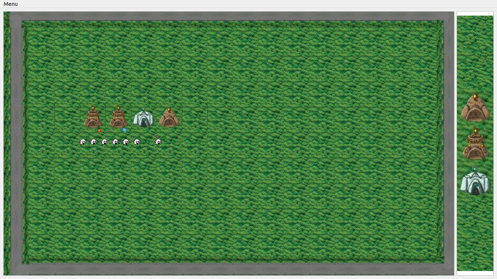

# Tower-Defense-Game
A simple tower defense game in C++ with Qt framework.
My first project in C++ with Qt.

## Technologies

1. C++11
2. Qt

## Rules

Your task is to prevent enemy units from reaching their target - the middle cell on the right side. Enemy units appear on the middle field on the left side. You can place towers that will shoot at enemy units. You cannot place towers in such a way that the path of units is closed. At the start of each round, you have 10 seconds to place towers. Each next round begins after the destruction of all units of the current round. To place a tower, first click to select a cell, then click on the tower button on the panel on the right. The game will end in defeat if at least one unit reaches the target.

## Game

  
